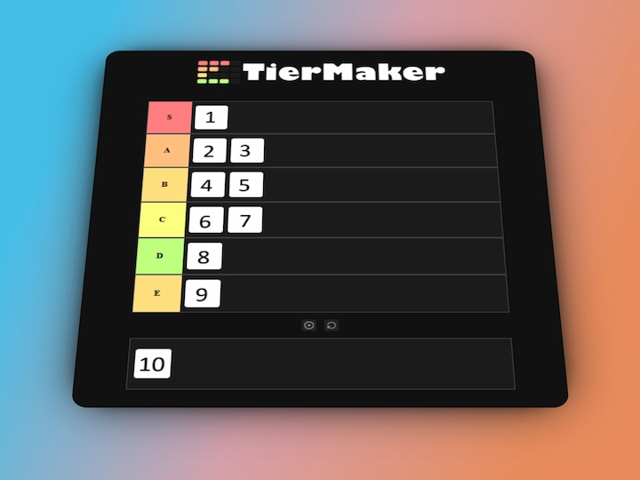

# Tier list maker - HTML, CSS & JS

A simple and interactive tier list built using pure HTML, CSS, and JavaScript. Features drag-and-drop functionality

## ✨ Features

- Drag and drop support for sorting items
- No dependencies\*
- Fast and lightweight – runs directly from `index.html`

> [!NOTE]
> A screenshot capture feature using a library will be added in the future.

### 🛠️ Technologies Used

- HTML
- CSS
- JavaScript (Vanilla)
- Drag & Drop

## 🚀 Getting Started

Just clone and open `index.html` in your browser.

## 📸 Preview

-
